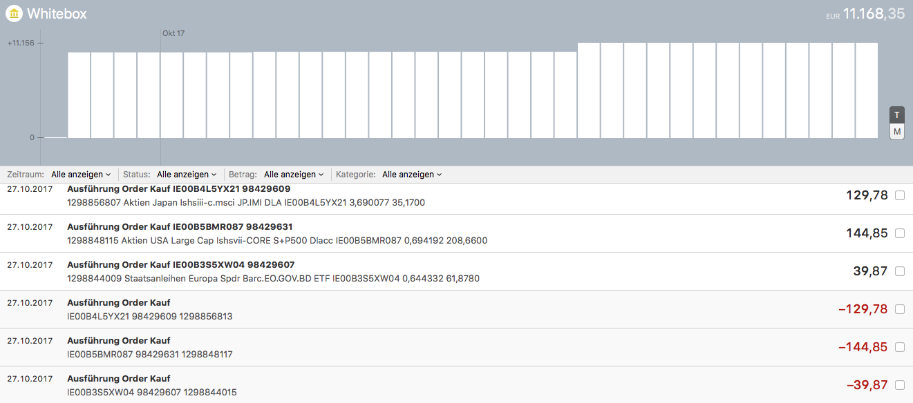
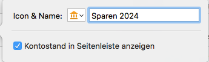
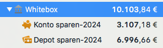

# moneymoney-whitebox
An Extension to query your Whitebox.eu goals in [MoneyMoney](https://moneymoney-app.com).

Es werden jeweils 4 Accounts für jedes aktive Ziel angelegt:
- KONTO = Umsätze Cash
- DEPOT = Umsätze im Depot
- PORTFOLIO = Bestand ETF 
- PERFORMANCE = Nur Informationen: Erfolgsrelevante Kapitalveränderungen, Geldgewichtete Rendite annualisiert, Geldgewichtete Rendite, Vermögensstand

Es macht Sinn als Kontogruppe zu gruppieren. Also KONTO und DEPOT hat in der Summe den Vermögensstand. Oder KONTO und PORTFOLIO.
Es macht keinen Sinn DEPOT und PORTFOLIO zu haben. Sie sind 2 Darstellungen des selben Vermögens. Die Summe wäre dann doppelt in Ihren Übersichten. 

Kurz:
- KONTO + DEPOT oder
- KONTO + PORTFOLIO
- PERFORMANCE optional dazu.

## Tipp: 
Zusammen als **Kontogruppe** mit *"Kontostand in Saldenleiste anzeigen"* zusammenfassen, dann hat man den Gesamtwert des Ziels 

## Spenden
Weil ich gefragt wurde: https://paypal.me/pools/c/8qnRn6AcLK
Spendenstand: 10 EUR 
Danke :)
